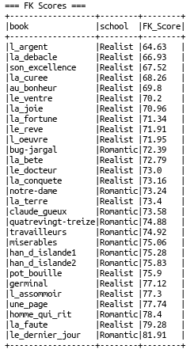
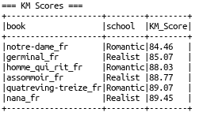
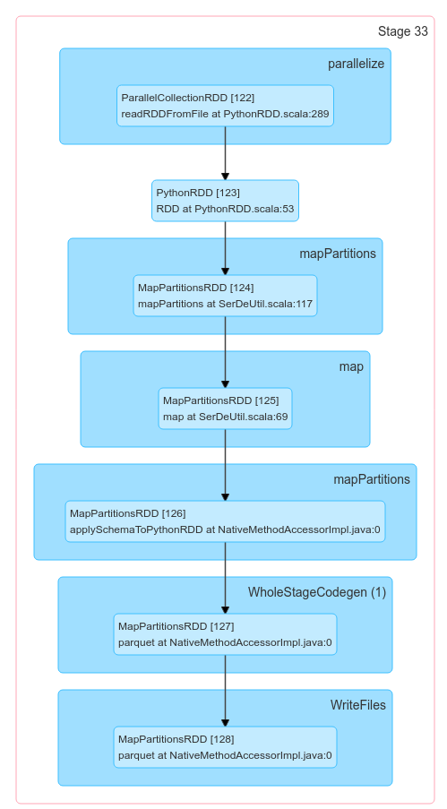
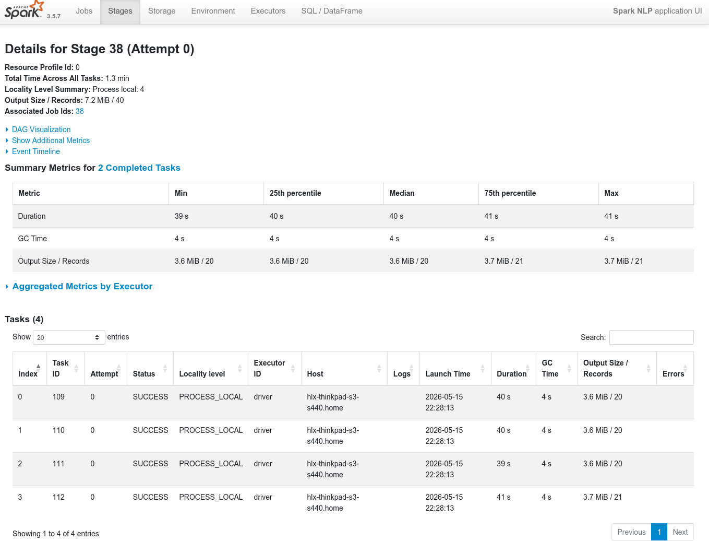
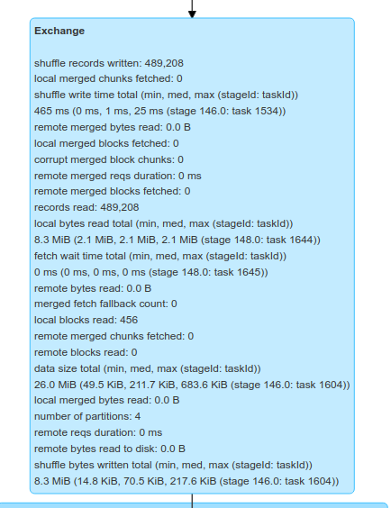
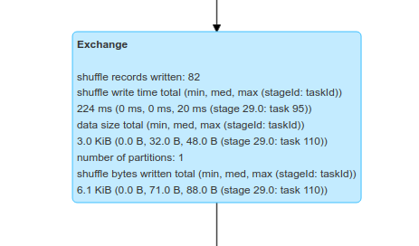

# 1. Data Description and Extraction Pipeline

## 1.1 Corpus Composition

My project analyzes a total of 35 19th century French novels. I divided these books into two main datasets:

- Dataset 1: English Translations (29 books). This includes 19 Realist novels by Émile Zola and 10 Romantic works by Victor Hugo. We use this large group for our main data pipeline.

- Dataset 2: French Originals (6 books). This is a smaller control group. It includes 3 books by Zola and 3 books by Hugo. This group is used to apply the Kandel-Moles readability index, which was designed for French.

All texts were retrieved from **Project Gutenberg** in UTF‑8 plain text format.

## 1.2 Extraction Logic

The goal is to get only the main story text. We need to remove Gutenberg’s headers and legal notices. We did this by:

1.  Checking if the cleaned file already exists in `book_data/`.
2.  Downloading the raw UTF‑8 file from Project Gutenberg once per unique URL (several short Hugo texts share the same URL).
3.  Extracting the text between the custom start and end tokens defined above.
4.  Saving the cleaned excerpt as `book_data/<book_title>.txt`.

Running our code will create two folders:`book_data/`(containing the 29 English texts) and `book_data_fr/` (containing the 6 French texts).

# 2. Load and Transform Pipeline

I have a 4 GB RAM limit. To avoid out-of-memory errors, each novel is split into chunks of 3000 words. This keeps individual rows small. The loading step creates a DataFrame with two columns: book and text. We split the text by whitespace. The size of 3000 words provides enough context for the NLP models to work well. We process the books one by one instead of loading all books at once. This fits our memory limits.

The annotated results are saved to Parquet format. Parquet was chosen because it supports nested data types produced by Spark NLP, offers fast read times, and compresses data efficiently.

# 3. Annotation Pipeline

Annotation is performed with Spark NLP’s pretrained pipeline "explain_document_ml". This model provides sentence detection, tokenization, lemmatization, and part-of-speech tagging. It is multilingual (hence the ml suffix) and works out of the box for French.

Spark is launched through sparknlp.start() with a heap limit of 1 GB and set spark.sql.shuffle.partitions to 1 to minimize shuffle overhead on a single‑machine setup. For each novel, the pipeline reads the cleaned text from book_data/. Split it into 3000‑word chunks. Create a small DataFrame with one column text. Apply the pretrained pipeline. Write the resulting annotated DataFrame to Parquet (overwrite mode). Discard the data and move to the next book.

# 4. Stylometric Analysis

This section addresses four analytical questions. First, do Realist and Romantic novels differ in overall text complexity? Second, how stable are readability scores across the length of a novel? Third, do all novels follow Zipf's Law regardless of author or literary school? Fourth, is dialogue structurally different from narration in the two corpora? These questions were chosen because they can be answered directly from token and sentence-level annotations produced by Spark NLP

## 4.1 Global Readability Comparison

Two readability formulas were applied. For the English translations, the Flesch-Kincaid (FK) formula was used. For the French originals, the Kandel-Moles (KM) formula was used. Both formulas use sentence length and syllable counts to produce a score. A higher score means the text is easier to read.

```{=html}
<iframe src="plots/readability_unified.html" width="100%" height="400px" style="border:none;"></iframe>
```

*Figure 4.1.1: Flesch-Kincaid Readability (English Translations).*



*Table 4.1.1: FK Readability Scores for all 29 English novels, ordered from lowest to highest.*

Both Realist and Romantic novels appear throughout the full range of scores. There is no clear separation between the two literary schools. Some Realist novels score very low, such as l_argent at 64.63, while others score high, such as la_faute at 79.28. The same pattern appears for Romantic novels: bug_jargal scores 72.39 while le_dernier_jour scores 81.91.

```{=html}
<iframe src="plots/kandel_moles_fr.html" width="100%" height="400px" style="border:none;"></iframe>
```

*Figure 4.1.2: Kandel-Moles Readability (French Originals).*



*Table 4.1.2: KM Readability Scores for the 6 French originals.*

The KM scores for the French originals are much more tightly grouped, ranging from 84.73 (germinal_fr) to 89.43 (nana_fr). Both Realist and Romantic novels cluster closely between 84 and 90. There is no clear difference between the two groups in the French data.

Comparing the two figures reveals an important finding. The wide score range seen in the English translations (64.63 to 81.91) does not appear in the French originals (84.73 to 89.43). This suggests that the variance observed in the English data may be partly caused by differences between translators rather than differences between authors.

## 4.2 Readability Volatility over Sliding Windows

A sliding window approach was used to track how readability changes throughout each novel. Two window sizes were tested: 500 words and 2000 words.

```{=html}
<iframe src="plots/sliding_window_ws500.html" width="100%" height="450px" style="border:none;"></iframe>
```

*Figure 4.2.1: Sliding Window Readability 500(English Translations).*

With a window size of 500 (Figure 4.2.1), the scores are very unstable. Most novels fluctuate between 0 and 100. Les Misérables shows two extreme negative spikes, dropping to approximately -200 at the 380k and 650k token positions. A window size of 500 is too small for stable readability measurement.

```{=html}
<iframe src="plots/sliding_window_ws2000.html" width="100%" height="450px" style="border:none;"></iframe>
```

*Figure 4.2.2: Sliding Window Readability 2000(English Translations).*

With a window size of 2000 (Figure 4.2.2), the scores are more stable. Most novels stay between 60 and 90. Notre-Dame shows a sharp drop to approximately 20 near the 100k token position. Les Misérables shows a drop to approximately 35 near the 380k token position. These drops correspond to specific chapters where sentences become very long.

```{=html}
<iframe src="plots/sliding_window_fr.html" width="100%" height="450px" style="border:none;"></iframe>
```

*Figure 4.2.3: Sliding Window Readability (French Originals).*

The French originals (Figure 4.2.3) show similar local volatility. Scores fluctuate between 75 and 100 for most books. Notre-Dame_fr shows two clear drops, one near 60k tokens dropping to approximately 48, and another near 100k tokens. The fact that Notre-Dame shows drops at similar narrative positions in both the English and French versions suggests these complexity shifts are a feature of the original text structure, not a translation effect.

## 4.3 Vocabulary Distribution and Zipf's Law

Word frequencies were counted for each novel and ranked from most frequent to least frequent. The results were plotted on a log-log scale. A black dashed line represents the ideal Zipf slope of -1.

```{=html}
<iframe src="plots/zipf.html" width="100%" height="400px" style="border:none;"></iframe>
```

*Figure 4.3.1: Zipf Distribution (English Translations).*

All 29 English novels follow a power-law distribution that runs parallel to the ideal slope line (Figure 4.3.1). The curves are stratified by text length. Les Misérables extends furthest to the right (reaching rank \~10k), reflecting its large vocabulary size. Claude Gueux ends earliest (around rank \~1k), reflecting its short length. No curve deviates significantly from the parallel pattern.

```{=html}
<iframe src="plots/zipf_fr.html" width="100%" height="400px" style="border:none;"></iframe>
```

*Figure 4.3.2: Zipf Distribution (French Originals).*

The 6 French originals (Figure 4.3.2) show the same behavior. All curves are parallel and close together, following the ideal slope closely. The French curves are more tightly grouped than the English ones, with less vertical spread between books. In both datasets, the rank-frequency relationship is consistent across all books regardless of author or literary movement. This confirms that Zipf's Law holds across both languages and both literary schools in this corpus.

## 4.4 Dialogue and Narration Analysis

Sentences were classified as dialogue or narration using different rules for each language. For the English texts, a sentence was marked as dialogue if it contained a " or ' character. For the French texts, a sentence was marked as dialogue if it contained « or », or if it started with — or -.

```{=html}
<iframe src="plots/dialogue.html" width="100%" height="400px" style="border:none;"></iframe>
```

*Figure 4.4.1:Average Sentence Length — Dialogue vs Narration (English Translations).*

```{=html}
<iframe src="plots/dialogue_fr.html" width="100%" height="400px" style="border:none;"></iframe>
```

*Figure 4.4.2:Average Sentence Length — Dialogue vs Narration (French Originals).*

In the English data, the detected dialogue sentences are longer than narration sentences. For Realist novels, the average dialogue sentence is 117.48 characters, while narration sentences average 96.16 characters. For Romantic novels, dialogue averages 105.30 characters and narration averages 79.11 characters. This result is unexpected. In natural language, dialogue is usually shorter than narration. The most likely explanation is that the English detection rule, which flags any sentence containing a quotation mark, also captures long narration sentences that contain a quoted word or short phrase. This noise in the classification inflates the average dialogue sentence length.

In the French data, the pattern is reversed. Dialogue sentences are shorter than narration sentences. For Realist novels, narration averages 79.85 characters while dialogue averages 21.02 characters. For Romantic novels, narration averages 73.55 characters and dialogue averages 65.55 characters. This result is more consistent with natural language expectations. The French detection rules using «» and — are more precise and less likely to capture narration sentences by mistake.

```{=html}
<iframe src="plots/dialogue_readability_en.html" width="100%" height="400px" style="border:none;"></iframe>
```

*Figure 4.4.3: Flesch-Kincaid Readability of Pure Dialogue (English Translations).*

```{=html}
<iframe src="plots/dialogue_readability_fr.html" width="100%" height="400px" style="border:none;"></iframe>
```

*Figure 4.4.4: Readability of Pure Dialogue (French Originals).*

The FK readability scores for English dialogue (Figure 4.4.3) show almost no difference between Realist (70) and Romantic (71) schools. This flat result is consistent with the noisy classification described above. The KM readability scores for French dialogue (Figure 4.4.4) show a clearer difference. Realist dialogue scores approximately 104 and Romantic dialogue scores approximately 97. This 7-point gap suggests that in the original French texts, Realist dialogue uses simpler vocabulary and shorter words than Romantic dialogue. However, this result should be interpreted carefully given the small size of the French corpus (only 6 books).

# 5.Experience with Spark and Big Data File Formats

## 5.1 How Spark Processes the Jobs

The Spark UI was used to observe how Spark executes the jobs in this workflow. Two types of jobs were examined: the annotation pipeline and the stylometric analysis.



*Figure 5.1.1: DAG visualization for Stage 33 — Parquet write operation.*

Figure 5.1.1 shows the DAG for Stage 33, which corresponds to the Parquet write operation during annotation. The DAG shows a linear sequence of six steps: parallelize → mapPartitions → map → mapPartitions → WholeStageCodegen → WriteFiles. T here are no shuffle boundaries in this stage. This means Spark completed the entire write operation within a single stage without moving data between partitions.

 *Figure 5.1.2: Stage 38 details — NLP annotation task.*

Figure 5.1.2 shows the details for Stage 38, which corresponds to the NLP annotation task. The stage ran 4 tasks. Each task took between 39 and 41 seconds. The GC time was 4 seconds per task, which represents approximately 10% of the total task duration. This indicates that the JVM garbage collector was active during processing, which is consistent with the 1 GB heap limit set for this machine.

## 5.2 Critical Shuffle Identification

A shuffle occurs when Spark needs to redistribute data across partitions. This happens during operations such as groupBy and join. Two shuffle operations were observed and compared.



*Figure 5.2.1: Exchange node for Zipf analysis — 489,208 shuffle records, 8.3 MiB.*

Figure 5.2.1 shows the Exchange node for the Zipf analysis. This operation computes word frequencies across all novels using groupBy("book", "word").count(). It produced 489,208 shuffle records and wrote 8.3 MiB of shuffle data. The total data size processed was 26.0 MiB. This is the largest shuffle in the entire workflow. It is large because every unique word in every novel must be collected and counted, which requires moving all token data across partitions.

{width="590"}

*Figure 5.2.2: Exchange node for book-level aggregation — 82 shuffle records.*

Figure 5.2.2 shows the Exchange node for a simpler aggregation using groupBy("book"). This operation produced only 82 shuffle records. The difference between 489,208 records and 82 records shows how much the complexity of the groupBy key affects shuffle size. When the groupBy key has few unique values (29 books), the shuffle is very small. When the key has many unique values (all unique words across 29 novels), the shuffle is very large.

```{python}
#| eval: false
#| code-fold: true

import os.path
import sys
import requests
import sparknlp
import plotly.graph_objects as go
from sparknlp.pretrained import PretrainedPipeline
from pyspark.sql import SparkSession


# =====================================================================
# Book definitions: URL and start/end tokens for body extraction
# =====================================================================

# ---------- Zola (Realist) ---------
## Zola's novels available at: https://www.gutenberg.org/browse/authors/z#a528

zola_urls = {}
zola_urls["la_fortune"]     = "https://www.gutenberg.org/ebooks/5135.txt.utf-8"
zola_urls["la_curee"]       = "https://www.gutenberg.org/ebooks/56590.txt.utf-8"
zola_urls["le_ventre"]      = "https://www.gutenberg.org/ebooks/5744.txt.utf-8"
zola_urls["la_conquete"]    = "https://www.gutenberg.org/ebooks/56860.txt.utf-8"
zola_urls["la_faute"]       = "https://www.gutenberg.org/ebooks/14200.txt.utf-8"
zola_urls["son_excellence"] = "https://www.gutenberg.org/ebooks/56654.txt.utf-8"
zola_urls["l_assommoir"]    = "https://www.gutenberg.org/ebooks/8558.txt.utf-8"
zola_urls["une_page"]       = "https://www.gutenberg.org/ebooks/13695.txt.utf-8"
#zola_urls["nana"]           = "" # not found
zola_urls["pot_bouille"]    = "https://www.gutenberg.org/ebooks/54686.txt.utf-8"
zola_urls["au_bonheur"]     = "https://www.gutenberg.org/ebooks/54726.txt.utf-8"
zola_urls["la_joie"]        = "https://www.gutenberg.org/ebooks/56541.txt.utf-8"
zola_urls["germinal"]       = "https://www.gutenberg.org/ebooks/56528.txt.utf-8"
zola_urls["l_oeuvre"]       = "https://www.gutenberg.org/ebooks/15900.txt.utf-8"
zola_urls["la_terre"]       = "https://www.gutenberg.org/ebooks/56687.txt.utf-8"
zola_urls["le_reve"]        = "https://www.gutenberg.org/ebooks/9499.txt.utf-8"
zola_urls["la_bete"]        = "https://www.gutenberg.org/ebooks/57038.txt.utf-8"
zola_urls["l_argent"]       = "https://www.gutenberg.org/ebooks/56987.txt.utf-8"
zola_urls["la_debacle"]     = "https://www.gutenberg.org/ebooks/13851.txt.utf-8"
zola_urls["le_docteur"]     = "https://www.gutenberg.org/ebooks/10720.txt.utf-8"

 # Start and end tokens to extract the main text body
zola_delimiters = {}  #
zola_delimiters["la_fortune"]     = ("On quitting Plassans", "upon a tombstone.")
zola_delimiters["la_curee"]       = ("On the return", "thousand francs.")
zola_delimiters["le_ventre"]      = ("Amidst the deep", "respectable people are!”")
zola_delimiters["la_conquete"]    = ("Désirée clapped", "glow.")
zola_delimiters["la_faute"]       = ("As La Teuse", "got a calf!’")
zola_delimiters["son_excellence"] = ("For a moment the President", "wonderfully able fellow!'")
zola_delimiters["l_assommoir"]    = ("Gervaise had waited", "quietly, my dear!\"")
zola_delimiters["une_page"]       = ("The night-lamp", "and for ever.")
#zola_delimiters["nana"]           = ("", "")
zola_delimiters["pot_bouille"]    = ("In the Rue", "Filth and Company.”")
zola_delimiters["au_bonheur"]     = ("Denise had come", "his wedded wife.")
zola_delimiters["la_joie"]        = ("When the cuckoo-clock", "and kill oneself!'")
zola_delimiters["germinal"]       = ("Over the open", "overturn the earth.")
zola_delimiters["l_oeuvre"]       = ("CLAUDE was passing", "go to work.’")
zola_delimiters["la_terre"]       = ("That morning Jean", "from the soil.")
zola_delimiters["le_reve"]        = ("During the severe", "a loving kiss.")
zola_delimiters["la_bete"]        = ("Roubaud, on entering", "who were singing.")
zola_delimiters["l_argent"]       = ("Eleven o'clock had", "which creates life?")
zola_delimiters["la_debacle"]     = ("In the middle", "a new France.")
zola_delimiters["le_docteur"]     = ("In the heat", "flag of life.")

# ---------- Hugo (Romantic) ----------
hugo_urls = {}
hugo_delimiters = {}

hugo_urls["notre-dame"]         = "https://www.gutenberg.org/ebooks/2610.txt.utf-8"
hugo_delimiters["notre-dame"]   = ("Three hundred and forty-eight years", "in his embrace, he fell to dust.")

hugo_urls["miserables"]         = "https://www.gutenberg.org/ebooks/135.txt.utf-8"
hugo_delimiters["miserables"]   = ("In 1815, M. Charles-François-Bienvenu", "lorsque le jour s’en va.")

hugo_urls["travailleurs"]       = "https://www.gutenberg.org/ebooks/32338.txt.utf-8"
hugo_delimiters["travailleurs"] = ("Christmas Day in the year", "Nothing was visible now but the sea.")

hugo_urls["homme_qui_rit"]      = "https://www.gutenberg.org/ebooks/12587.txt.utf-8"
hugo_delimiters["homme_qui_rit"]= ("Ursus and Homo were", "looking down upon the water.")

hugo_urls["quatrevingt-treize"] = "https://www.gutenberg.org/ebooks/49372.txt.utf-8"
hugo_delimiters["quatrevingt-treize"] = ("During the last days of May", "with the radiance of the other.")

hugo_urls["han_d_islande1"]     = "https://www.gutenberg.org/ebooks/65214.txt.utf-8"
hugo_delimiters["han_d_islande1"] = ("“That’s what comes", "I am here! I am here!”")

hugo_urls["han_d_islande2"]     = "https://www.gutenberg.org/ebooks/65215.txt.utf-8"
hugo_delimiters["han_d_islande2"] = ("The regiment of musketeers", "counts of Danneskiold.")

hugo_urls["bug-jargal"]         = "https://www.gutenberg.org/ebooks/50010.txt.utf-8"
hugo_delimiters["bug-jargal"]   = ("WHEN it came to the turn of Captain", "his country’s guillotine?”")

hugo_urls["le_dernier_jour"]    = "https://www.gutenberg.org/ebooks/50010.txt.utf-8"
hugo_delimiters["le_dernier_jour"] = ("For five whole weeks", "carrying me on to the scaffold....")

hugo_urls["claude_gueux"]       = "https://www.gutenberg.org/ebooks/50010.txt.utf-8"
hugo_delimiters["claude_gueux"] = ("CLAUDE GUEUX was a poor workman", "use cold steel.”")


# =====================================================================
# Merge Zola and Hugo dictionaries for unified processing
# =====================================================================
all_urls = {**zola_urls, **hugo_urls}
all_delimiters = {**zola_delimiters, **hugo_delimiters}


# =====================================================================
# Download and cleaning pipeline
# ====================================================================
downloaded_raw_files = {}

for book_title, url in all_urls.items():
    # 
    clean_path = os.path.join("book_data", book_title + ".txt")
    if os.path.exists(clean_path):
        print(f"Skipping {book_title} – already cleaned.")
        continue

    # Obtain raw text (download only once per unique URL)
    if url not in downloaded_raw_files:
        # 
        raw_filename = url.split("/")[-1]
        raw_path = os.path.join("book_data", raw_filename)

        if not os.path.exists(raw_path):
            r = requests.get(url)
            print(f"Downloaded {url} -> {raw_filename}")
            os.makedirs("book_data", exist_ok=True)
            with open(raw_path, "w", encoding="utf-8") as f:
                f.write(r.text)
        downloaded_raw_files[url] = raw_path
    else:
        raw_path = downloaded_raw_files[url]

    # 
    with open(raw_path, "r", encoding="utf-8") as f:
        full_text = f.read()

    start_token, end_token = all_delimiters[book_title]
    start_idx = full_text.find(start_token)
    end_idx = full_text.rfind(end_token) + len(end_token)

    if start_idx == -1 or end_idx == -1:
        print(f"Warning: Delimiter not found for {book_title}, using whole text.")
        extracted = full_text
    else:
        extracted = full_text[start_idx:end_idx]

    # Save the cleaned text
    with open(clean_path, "w", encoding="utf-8") as f:
        size = f.write(extracted)
    print(f"Saved {clean_path}  ({size} bytes)")
```

```{python}
#| eval: false
#| code-fold: true

# =====================================================================
# Helper function: split a text into word-based chunks
# =====================================================================
def split_text(text, chunk_size=3000):
    """
    Split a long string into a list of chunks,
    each containing approximately `chunk_size` words.
    """
    words = text.split()
    chunks = []
    for i in range(0, len(words), chunk_size):
        chunks.append(" ".join(words[i:i+chunk_size]))
    return chunks
  
# =====================================================================
# Spark NLP Annotation Pipeline
# =====================================================================
# Stop any previous Spark session to avoid port conflicts
existing = SparkSession.getActiveSession()
if existing:
    existing.stop()

# Start a Spark NLP session with limited memory
spark = sparknlp.start(memory="1g")
spark.conf.set("spark.sql.shuffle.partitions", "1")

# Load the pretrained pipeline (will download once if not cached)
explain_document_pipeline = PretrainedPipeline("explain_document_ml")

# Process each book independently
for book_title in all_urls:
    file_path = os.path.join("book_data", book_title + ".txt")
    if not os.path.exists(file_path):
        print(f"Missing {file_path}, skipping")
        continue

    with open(file_path, "r", encoding="utf-8") as f:
        book_text = f.read()

    # Chunk the text
    chunks = split_text(book_text, chunk_size=3000)
    book_data = [[chunk] for chunk in chunks]

    # Create a DataFrame for this book only
    df = spark.createDataFrame(book_data).toDF("text")

    # Run the NLP pipeline
    result = explain_document_pipeline.transform(df)

    # Persist annotated data to Parquet
    result.write.mode("overwrite").parquet(f"results/{book_title}")
    print(f"Done: {book_title}")

print("All 29 novels processed!")

```

```{python}
#| eval: false
#| code-fold: true

# ============================================================
# A.4 Stylometric Analysis (Unified English Corpus Optimized)
# ============================================================
import os
import re
import sparknlp
from pyspark.sql import SparkSession, functions as F, Window
from pyspark.sql.types import IntegerType, BooleanType
import plotly.express as px
import plotly.graph_objects as go
import pandas as pd

# ---------- Preparation: Literary School Definitions ----------
# List of Zola's books to distinguish "Realist" from "Romantic"
zola_books = [
    "la_fortune", "la_curee", "le_ventre", "la_conquete", "la_faute",
    "son_excellence", "l_assommoir", "une_page", "pot_bouille", 
    "au_bonheur", "la_joie", "germinal", "l_oeuvre", "la_terre", 
    "le_reve", "la_bete", "l_argent", "la_debacle", "le_docteur"
]

# ---------- Spark Session ----------
existing = SparkSession.getActiveSession()
if existing:
    existing.stop()

spark = sparknlp.start(memory="1g")
spark.conf.set("spark.sql.shuffle.partitions", "4")

# ---------- Helper: Load Corpus ----------
def load_annotated_corpus(results_dir="results"):
    first = True
    for folder in os.listdir(results_dir):
        path = os.path.join(results_dir, folder)
        if not os.path.isdir(path):
            continue
        df = spark.read.parquet(path)
        df = df.withColumn("book", F.lit(folder))   
        if first:
            all_df = df
            first = False
        else:
            all_df = all_df.unionByName(df)
    return all_df

annotated_df = load_annotated_corpus()

# ---------- Helper: English Syllable Counting ----------
def english_syllable_count(word):
    word = word.lower()
    if len(word) <= 3: return 1
    word = re.sub(r'(?:[^laeiouy]es|ed|[^laeiouy]e)$', '', word)
    word = re.sub(r'^y', '', word)
    matches = re.findall(r'[aeiouy]{1,2}', word)
    return max(1, len(matches))

english_syllable_udf = F.udf(english_syllable_count, IntegerType())
```

```{python}
#| eval: false
#| code-fold: true

# ============================================================
# A.4.1 Readability Indices (Flesch-Kincaid Only)
# ============================================================
chunk_stats = annotated_df.select(
    "book",
    F.size("sentence").alias("num_sentences"),
    "token.result"
).withColumnRenamed("result", "tokens")

chunk_stats = chunk_stats.withColumn(
    "school",
    F.when(F.col("book").isin(zola_books), "Realist").otherwise("Romantic")
)

# Sentence statistics per book
sentences_per_book = chunk_stats.groupBy("book", "school").agg(
    F.sum("num_sentences").alias("total_sentences")
)

# Token and Syllable statistics
tokens_exploded = chunk_stats.select("book", F.explode("tokens").alias("token_word"))
tokens_exploded = tokens_exploded.withColumn("syllables", english_syllable_udf(F.col("token_word")))

words_per_book = tokens_exploded.groupBy("book").agg(
    F.count("token_word").alias("total_words"),
    F.sum("syllables").alias("total_syllables")
)

# Merge data and calculate Flesch-Kincaid Score
book_agg = sentences_per_book.join(words_per_book, on="book")

book_indices = book_agg.withColumn(
    "FK_Score",
    F.round(206.835 - 1.015 * (F.col("total_words") / F.col("total_sentences")) - 
            84.6 * (F.col("total_syllables") / F.col("total_words")), 2)
)

pandas_indices = book_indices.toPandas()

# Plotting: Color by Literary School
fig_readability = px.bar(pandas_indices, x="book", y="FK_Score", color="school",
             title="Flesch-Kincaid Readability Indices per Novel",
             labels={"FK_Score": "Flesch-Kincaid Score", "school": "Literary School"})
fig_readability.update_xaxes(categoryorder="category ascending") 
fig_readability.write_html("plots/readability_unified.html")

print("=== FK Scores ===")
print(pandas_indices.to_string())

#=======dialogue===============================
# Create sentences_df_en directly from the existing annotated_df
sentences_extracted = annotated_df.select(
    "book",
    F.explode("sentence.result").alias("sentence")
)

# Add the school column to the sentences using zola_books list
sentences_extracted = sentences_extracted.withColumn(
    "school",
    F.when(F.col("book").isin(zola_books), "Realist").otherwise("Romantic")
)

# Identify dialogue sentences by checking for quotation marks
sentences_df_en = sentences_extracted.withColumn(
    "dialogue",
    F.col("sentence").contains('"') | F.col("sentence").contains("'")
)

# Filter out pure dialogue sentences from the English dataset
dialogue_only_en = sentences_df_en.filter(F.col("dialogue") == True)

# Split the dialogue sentences into individual words
dialogue_words_en = dialogue_only_en.withColumn(
    "word", F.explode(F.split(F.col("sentence"), r"\W+"))
).filter(F.length(F.col("word")) > 0)

# Calculate syllables using your exact function name from the top code
dialogue_words_en = dialogue_words_en.withColumn("syllables", english_syllable_udf(F.col("word")))

dialogue_word_stats_en = dialogue_words_en.groupBy("school").agg(
    F.count("word").alias("total_words"),
    F.sum("syllables").alias("total_syllables")
)

dialogue_sentence_stats_en = dialogue_only_en.groupBy("school").agg(
    F.count("sentence").alias("total_sentences")
)

# Join the metrics and apply the Flesch-Kincaid formula
dialogue_fk = dialogue_word_stats_en.join(dialogue_sentence_stats_en, on="school")
dialogue_fk = dialogue_fk.withColumn(
    "Dialogue_FK_Score",
    F.round(206.835 - 1.015 * (F.col("total_words") / F.col("total_sentences")) - 84.6 * (F.col("total_syllables") / F.col("total_words")), 2)
)

# Convert the results to a Pandas DataFrame for plotting
dialogue_fk_pd = dialogue_fk.toPandas()

# Create the bar chart to compare schools
fig_dialogue_fk = px.bar(
    dialogue_fk_pd, 
    x="school", 
    y="Dialogue_FK_Score", 
    color="school",
    title="Readability of Pure Dialogue (Flesch-Kincaid)",
    labels={"Dialogue_FK_Score": "Flesch-Kincaid Score (Higher = Easier)"},
    color_discrete_map={"Realist": "blue", "Romantic": "red"}
)

fig_dialogue_fk.update_layout(template="plotly_white")
fig_dialogue_fk.write_html("plots/dialogue_readability_en.html")

```

```{python}
#| eval: false
#| code-fold: true

# ============================================================
# A.4.2 Sliding Window Readability 
# ============================================================
def sliding_window_readability(book_name, window_size=500, step=250):
    tokens_df = annotated_df.filter(F.col("book") == book_name).select("token")
    all_words = []
    for row in tokens_df.collect():
        for token_ann in row.token:
            all_words.append(token_ann.result)
    
    results = []
    for start in range(0, len(all_words) - window_size + 1, step):
        window_words = all_words[start:start+window_size]
        sentences = sum(1 for w in window_words if w.endswith(('.', '!', '?')))
        if sentences == 0: continue
        
        word_count = len(window_words)
        syllable_count = sum(english_syllable_count(w) for w in window_words)
        score = 206.835 - 1.015 * (word_count / sentences) - 84.6 * (syllable_count / word_count)
            
        results.append({"position": start, "Score": score})
    return pd.DataFrame(results)

highlight_books = {
    "miserables": "blue",    
    "notre-dame": "cyan",    
    "germinal": "red",       
    "l_assommoir": "orange"  
}

window_sizes = [500, 2000]

all_book_names = annotated_df.select("book").distinct().toPandas()["book"].tolist()


for ws in window_sizes:
    fig_sliding = go.Figure()
    for book in all_book_names:
        df_slide = sliding_window_readability(book, window_size=ws, step=ws//2)
        if df_slide.empty: continue
            
        if book in highlight_books:
            line_color, line_width, opacity, showlegend = highlight_books[book], 2.5, 1.0, True
        else:
            line_color, line_width, opacity, showlegend = "lightgrey", 1, 0.4, False 
            
        fig_sliding.add_trace(go.Scatter(
            x=df_slide["position"], y=df_slide["Score"], mode="lines", 
            name=book if showlegend else "", line=dict(color=line_color, width=line_width),
            opacity=opacity, showlegend=showlegend, hoverinfo="name+y"
        ))

    fig_sliding.update_layout(title=f"Sliding Window Flesch-Kincaid (Window = {ws})", template="plotly_white")
    fig_sliding.write_html(f"plots/sliding_window_ws{ws}.html")
    
```

```{python}
#| eval: false
#| code-fold: true

# ============================================================
# A.4.3 Zipf Distribution per Document 
# ============================================================
from pyspark.sql import Window, functions as F
import plotly.express as px
import plotly.graph_objects as go

print("Processing 4.3 Zipf's Law Analysis...")

# Verify schema and extract words
cols = annotated_df.columns
if "lemmas" in cols:
    print("Using lemmas.result for frequency count...")
    words_df = annotated_df.select("book", F.explode("lemmas.result").alias("word"))
elif "token" in cols:
    print("Lemmas not found, using token.result (lowercased)...")
    words_df = annotated_df.select("book", F.explode("token.result").alias("word"))
    words_df = words_df.withColumn("word", F.lower(F.col("word")))
else:
    print("Error: Required fields not found! Check annotation pipeline.")
    words_df = None

if words_df:
    # Filter out punctuation and very short words
    words_df = words_df.filter(F.length(F.col("word")) > 1)

    # Word frequency count
    word_counts = words_df.groupBy("book", "word").agg(F.count("*").alias("frequency"))

    # Calculate rank within each book
    window_spec = Window.partitionBy("book").orderBy(F.desc("frequency"))
    word_ranked = word_counts.withColumn("rank", F.row_number().over(window_spec))

    # Convert to Pandas for plotting
    zipf_pd = word_ranked.toPandas()
    
    if len(zipf_pd) > 0:
        fig_zipf = px.line(zipf_pd, x="rank", y="frequency", color="book", 
                           log_x=True, log_y=True, 
                           title="Zipf Distribution per Document (Log-Log Scale)")
        
        # Add ideal slope (-1) as a reference line
        max_f = zipf_pd['frequency'].max()
        fig_zipf.add_trace(go.Scatter(x=[1, 10000], y=[max_f, max_f/10000],
                                      mode="lines", line=dict(dash="dash", color="black"), 
                                      name="Ideal slope -1"))
        
        fig_zipf.write_html("plots/zipf.html")
        print(" plots/zipf.html")
    else:
        print("Warning: Empty Zipf data, plot not generated.")
```

```{python}
#| eval: false
#| code-fold: true

# ============================================================
# A.4.4 Dialogue vs. Narration Segmentation
# ============================================================
def is_dialogue(sentence_text):
    if sentence_text is None: return False
    # Heuristic check for dialogue based on quotation marks
    return ('"' in sentence_text) or ("''" in sentence_text)

is_dialogue_udf = F.udf(is_dialogue, BooleanType())

sentences_df = annotated_df.select(
    "book",
    F.explode("sentence.result").alias("sentence")
)
sentences_df = sentences_df.withColumn("dialogue", is_dialogue_udf(F.col("sentence")))
sentences_df = sentences_df.withColumn("length", F.length(F.col("sentence")))

sentences_df = sentences_df.withColumn(
    "school",
    F.when(F.col("book").isin(zola_books), "Realist").otherwise("Romantic")
)

summary = sentences_df.groupBy("school", "dialogue").agg(
    F.avg("length").alias("avg_length"),
    F.count("*").alias("sentence_count")
).toPandas()

summary["category"] = summary["dialogue"].map({True: "Dialogue", False: "Narration"})

fig_dialogue = px.bar(summary, x="school", y="avg_length", color="category", barmode="group",
                      title="Average Sentence Length: Dialogue vs. Narration by Literary School",
                      labels={"avg_length": "Avg Characters per Sentence", "school": "Literary Movement"})
fig_dialogue.write_html("plots/dialogue.html")

print("=== English Dialogue vs Narration ===")
print(summary.to_string())

print("All stylometric analyses complete!")
```

```{python}
#| eval: false
#| code-fold: true

import os
import re
import requests
import sparknlp
from sparknlp.pretrained import PretrainedPipeline
from pyspark.sql import SparkSession, functions as F, Window
from pyspark.sql.types import IntegerType, BooleanType
import plotly.express as px
import plotly.graph_objects as go
import pandas as pd

# =====================================================================
# French Data Definition & Download
# =====================================================================
books_fr = {
    "assommoir_fr": "https://www.gutenberg.org/cache/epub/6497/pg6497.txt",
    "germinal_fr": "https://www.gutenberg.org/cache/epub/5711/pg5711.txt",
    "nana_fr": "https://www.gutenberg.org/cache/epub/5250/pg5250.txt",
    "notre-dame_fr": "https://www.gutenberg.org/cache/epub/19657/pg19657.txt",
    "homme_qui_rit_fr": "https://www.gutenberg.org/ebooks/5423.txt.utf-8",
    "quatreving-treize_fr": "https://www.gutenberg.org/ebooks/9645.txt.utf-8"
}

delimiters_fr = {
    "assommoir_fr": ("Gervaise avait attendu", "Fais dodo, ma belle!"),
    "germinal_fr": ("Dans la plaine rase", "éclater la terre."),
    "nana_fr": ("A neuf heures", "à Berlin!  à Berlin!"),
    "notre-dame_fr": ("Il y a aujourd'hui trois cent", "il tomba en poussière."),
    "homme_qui_rit_fr": ("Ursus et Homo étaient", "la mer."),
    "quatreving-treize_fr": ("Dans les derniers jours de mai", "la lumière de l'autre.")
}

zola_books_fr = ["assommoir_fr", "germinal_fr", "nana_fr"]

os.makedirs("book_data_fr", exist_ok=True)
downloaded_fr = {}

for book_title, url in books_fr.items():
    clean_path = os.path.join("book_data_fr", book_title + ".txt")
    if os.path.exists(clean_path):
        continue

    if url not in downloaded_fr:
        raw_filename = url.split("/")[-1]
        raw_path = os.path.join("book_data_fr", raw_filename)
        if not os.path.exists(raw_path):
            r = requests.get(url)
            with open(raw_path, "w", encoding="utf-8") as f:
                f.write(r.text)
        downloaded_fr[url] = raw_path
    else:
        raw_path = downloaded_fr[url]

    with open(raw_path, "r", encoding="utf-8") as f:
        full_text = f.read()

    start_token, end_token = delimiters_fr[book_title]
    start_idx = full_text.find(start_token)
    end_idx = full_text.rfind(end_token) + len(end_token)
    
    extracted = full_text[start_idx:end_idx] if start_idx != -1 else full_text
    with open(clean_path, "w", encoding="utf-8") as f:
        f.write(extracted)

# =====================================================================
# French Annotation
# =====================================================================
existing = SparkSession.getActiveSession()
if existing: existing.stop()

spark = sparknlp.start(memory="1g")
spark.conf.set("spark.sql.shuffle.partitions", "4")
pipeline = PretrainedPipeline("explain_document_ml") # ml pipeline supports French

def split_text(text, chunk_size=3000):
    words = text.split()
    return [" ".join(words[i:i+chunk_size]) for i in range(0, len(words), chunk_size)]

os.makedirs("results_fr", exist_ok=True)

for book_title in books_fr:
    if os.path.exists(f"results_fr/{book_title}"): continue
    with open(f"book_data_fr/{book_title}.txt", "r", encoding="utf-8") as f:
        chunks = split_text(f.read())
    df = spark.createDataFrame([[c] for c in chunks]).toDF("text")
    res = pipeline.transform(df)
    res.write.mode("overwrite").parquet(f"results_fr/{book_title}")

# Load all French annotated data
def load_fr_corpus():
    first = True
    for folder in os.listdir("results_fr"):
        path = os.path.join("results_fr", folder)
        if not os.path.isdir(path): continue
        df = spark.read.parquet(path).withColumn("book", F.lit(folder))
        if first:
            all_df = df
            first = False
        else:
            all_df = all_df.unionByName(df)
    return all_df

df_fr = load_fr_corpus()

# French Dialogue vs. Narration  
# =====================================================================
def is_french_dialogue(sentence):
    if not sentence: return False
    txt = sentence.strip()
    return ('«' in txt) or ('»' in txt) or txt.startswith('—') or txt.startswith('-')

is_fr_dialogue_udf = F.udf(is_french_dialogue, BooleanType())

sentences_df_fr = df_fr.select("book", F.explode("sentence.result").alias("sentence"))
sentences_df_fr = sentences_df_fr.withColumn("dialogue", is_fr_dialogue_udf(F.col("sentence")))
sentences_df_fr = sentences_df_fr.withColumn("length", F.length(F.col("sentence")))
sentences_df_fr = sentences_df_fr.withColumn("school",F.when(F.col("book").isin(zola_books_fr), "Realist").otherwise("Romantic"))

# =====================================================================
#  Kandel-Moles Readability
# =====================================================================
def french_syllable_count(word):
    word = word.lower()
    if len(word) <= 3: return 1
    #  e, es, ent
    word = re.sub(r'es?$', '', word)
    word = re.sub(r'ent$', '', word)
    matches = re.findall(r'[aeiouyéàèùâêîôûëïüÿœæ]+', word)
    return max(1, len(matches))

fr_syllable_udf = F.udf(french_syllable_count, IntegerType())

chunk_stats_fr = df_fr.select("book", F.size("sentence").alias("num_sentences"), "token.result").withColumnRenamed("result", "tokens")
chunk_stats_fr = chunk_stats_fr.withColumn("school", F.when(F.col("book").isin(zola_books_fr), "Realist").otherwise("Romantic"))

sentences_fr = chunk_stats_fr.groupBy("book", "school").agg(F.sum("num_sentences").alias("total_sentences"))
tokens_fr = chunk_stats_fr.select("book", F.explode("tokens").alias("word")).withColumn("syllables", fr_syllable_udf(F.col("word")))
words_fr = tokens_fr.groupBy("book").agg(F.count("word").alias("total_words"), F.sum("syllables").alias("total_syllables"))

# 
book_agg_fr = sentences_fr.join(words_fr, on="book")
book_indices_fr = book_agg_fr.withColumn(
    "KM_Score",
    F.round(207 - 1.015 * (F.col("total_words") / F.col("total_sentences")) - 73.6 * (F.col("total_syllables") / F.col("total_words")), 2)
)

fig_km = px.bar(book_indices_fr.toPandas(), x="book", y="KM_Score", color="school",
                title="Kandel-Moles Readability Indices (Original French Texts)",
                labels={"KM_Score": "Kandel-Moles Score"})
fig_km.write_html("plots/kandel_moles_fr.html")

#Kandel-Moles for Dialogues Only
# 
dialogue_only_fr = sentences_df_fr.filter(F.col("dialogue") == True)

# 
dialogue_words_fr = dialogue_only_fr.withColumn(
    "word", F.explode(F.split(F.col("sentence"), r"\W+"))
).filter(F.length(F.col("word")) > 0)

# 
dialogue_words_fr = dialogue_words_fr.withColumn("syllables", fr_syllable_udf(F.col("word")))


dialogue_word_stats = dialogue_words_fr.groupBy("school").agg(
    F.count("word").alias("total_words"),
    F.sum("syllables").alias("total_syllables")
)

# 
dialogue_sentence_stats = dialogue_only_fr.groupBy("school").agg(
    F.count("sentence").alias("total_sentences")
)

# 
dialogue_km = dialogue_word_stats.join(dialogue_sentence_stats, on="school")
dialogue_km = dialogue_km.withColumn(
    "Dialogue_KM_Score",
    F.round(207 - 1.015 * (F.col("total_words") / F.col("total_sentences")) - 73.6 * (F.col("total_syllables") / F.col("total_words")), 2)
)

dialogue_km_pd = dialogue_km.toPandas()

# 
fig_dialogue_km = px.bar(
    dialogue_km_pd, 
    x="school", 
    y="Dialogue_KM_Score", 
    color="school",
    title="Readability of Pure Dialogue (Kandel-Moles)",
    labels={"Dialogue_KM_Score": "Kandel-Moles Score (Higher = Easier)"},
    color_discrete_map={"Realist": "blue", "Romantic": "red"}
)

fig_dialogue_km.update_layout(template="plotly_white")
fig_dialogue_km.write_html("plots/dialogue_readability_fr.html")

print("=== French Dialogue vs Narration ===")
print(summary_fr.to_string())

# =====================================================================
# French Sliding Window
# =====================================================================
def sliding_window_fr(book_name, window_size=2000, step=1000):
    words = []
    for row in df_fr.filter(F.col("book") == book_name).select("token.result").collect():
        words.extend(row.result)
    
    results = []
    for start in range(0, len(words) - window_size + 1, step):
        window_words = words[start:start+window_size]
        sentences = sum(1 for w in window_words if w.endswith(('.', '!', '?')))
        if sentences == 0: continue
        wc = len(window_words)
        sc = sum(french_syllable_count(w) for w in window_words)
        score = 207 - 1.015 * (wc / sentences) - 73.6 * (sc / wc)
        results.append({"position": start, "Score": score})
    return pd.DataFrame(results)

fig_slide_fr = go.Figure()
for book in books_fr.keys():
    df_slide = sliding_window_fr(book)
    if not df_slide.empty:
        fig_slide_fr.add_trace(go.Scatter(x=df_slide["position"], y=df_slide["Score"], mode="lines", name=book))
fig_slide_fr.update_layout(title="Sliding Window Kandel-Moles Readability (Window Size = 2000)", template="plotly_white")
fig_slide_fr.write_html("plots/sliding_window_fr.html")

# =====================================================================
# French Zipf's Law
# =====================================================================
words_df_fr = df_fr.select("book", F.explode("token.result").alias("word")).withColumn("word", F.lower(F.col("word"))).filter(F.length(F.col("word")) > 1)
word_counts_fr = words_df_fr.groupBy("book", "word").agg(F.count("*").alias("frequency"))
zipf_ranked_fr = word_counts_fr.withColumn("rank", F.row_number().over(Window.partitionBy("book").orderBy(F.desc("frequency")))).toPandas()

fig_zipf_fr = px.line(zipf_ranked_fr, x="rank", y="frequency", color="book", log_x=True, log_y=True, title="Zipf Distribution (French Originals)")
max_f = zipf_ranked_fr['frequency'].max()
fig_zipf_fr.add_trace(go.Scatter(x=[1, 10000], y=[max_f, max_f/10000], mode="lines", line=dict(dash="dash", color="black"), name="Ideal slope -1"))
fig_zipf_fr.write_html("plots/zipf_fr.html")

summary_fr = sentences_df_fr.groupBy("school", "dialogue").agg(F.avg("length").alias("avg_length")).toPandas()
summary_fr["category"] = summary_fr["dialogue"].map({True: "Dialogue", False: "Narration"})

fig_dialogue_fr = px.bar(summary_fr, x="school", y="avg_length", color="category", barmode="group",
                         title="Average Sentence Length: Dialogue vs Narration (French)",
                         labels={"avg_length": "Avg Characters per Sentence"})
fig_dialogue_fr.write_html("plots/dialogue_fr.html")

print("Ok_rench version")

```
